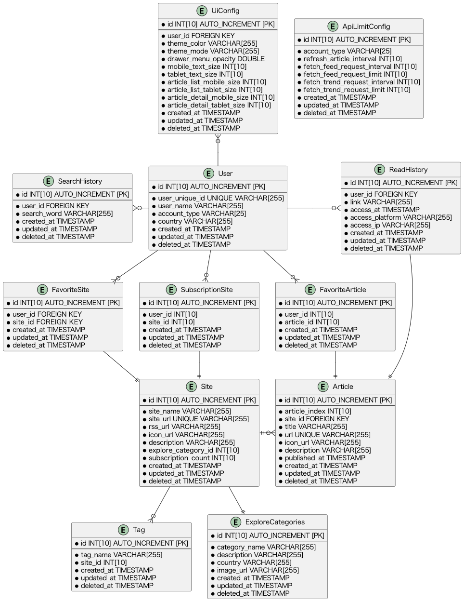

# FeedaysのバックエンドAPI
- このプロジェクトは開発しているRSSリーダーサービスのサーバーレスなバックエンドAPI部分です
- サーバーサイドの言語にGoを採用しており、SQLはGORMを使用しています。
- 関数コードをドッカーコンテナにしてECRにプッシュしてLambdaで動かしています
- インフラはAWSを採用しており、APIGW＋Lambda+RDSProxy＋RDS
  - IaCはTerraform＋Terragruntを採用しており、開発・運用を見据えて開発環境・本番環境を切り替えることが出来ます
# クラウド構成
APIGW->Lambda(Go)->RDSProxy->RDS(MySQL)

# 以下使用技術一覧やコンセプト
- ラムダ動作言語: Go
  - 実行速度などでもっとも効率がいい言語はRustだと思うが、Goが一番バックエンドとしてデファクトになりつつあるので、Goを採用
  - Rustと似たような書き方・文法なので簡単に習得ができた
- IaC: Terraform+Terragrunt(IaCの保守・運用性を効率的にするツール)
  - 素のテラフォームだとフォルダ分けがしづらいなど使い心地/DRYしずらいなどの保守・可読性が悪いのでTerragruntを採用
  - これにより、素のテラフォームだと出来ないフォルダ分けやDRYが出来るようになり、保守性・可読性が大きく向上
- API定義言語: OpenAPI
  - AppSyncやGraphQLを使うという選択肢もあったが、密結合や学習コスト等を考えて、一番ハードルが低いであろうOpenAPIを採用
  - API定義言語にそこまでのコストを払えないと判断
- データベースアクセス: GORM（ORM）
  - データベースアクセスにはもっともメジャーなGORMを採用
- データベース: MySQL
  - ポートフォリオとしてメジャーなSQLエンジンであるMySQLを採用

# CI/CD（Github Actions）
- ラムダ関数のCI/CDはGithub Actionsで行っています
- サービス全体のCI/CDは実装予定

# 開発環境
Dockerfileで開発コンテナを記述してVSCodeのRemote Containerで開発環境を構築しています。

# バックエンド開発に際してのプログラミングノート
- [技術選定](./バックエンド開発メモ/0-技術選定.md)
- [開発環境構築](./バックエンド開発メモ/1-開発環境構築.md)
- [API設計](./バックエンド開発メモ/2-API設計.md)
- [テーブル設計-ER図](./バックエンド開発メモ/3-テーブル設計-ER図.plantuml)
- [Go開発](./バックエンド開発メモ/4-Go開発.md)
- [IacでAWS RDS＋Proxyを構築・デバッグ](./バックエンド開発メモ/5-IaCでDBを構築・デバッグ.md)
- [DB開発・実装](./バックエンド開発メモ/6-DB開発・実装.md)
- [テスト・デバッグ](./バックエンド開発メモ/7-テスト・デバッグ.md)

# ER図
PlantUMLでER図を作成しております

